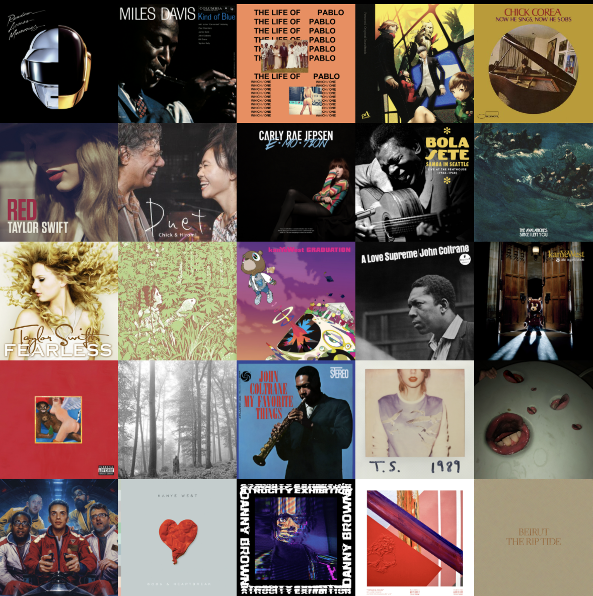

# next.fm

Last.fm is a great service, but its services only show you your most-listened to albums/artists/tracks by number of scrobbles (i.e. plays), NOT by amount of time listened.

I was interested in seeing which albums I spent the most time listening to, so I wrote this script using the last.fm API. The API doesn't make this data straightforward to find, as one endpoint (getrecenttracks) returns all the tracks you listen to, but the track information doesn't contain the duration. Conversely, another enpoint (gettoptracks) DOES return the duration, but doesn't include the album associated with the track. Because of this issue, previous approaches [[0]](https://github.com/LenaMartens/lastfm-duration-sort) [[1]](https://www.reddit.com/r/lastfm/comments/fpmvmb/check_your_artists_by_minute_scrobbled/) [[2]](https://timewhizzs.net/) [[3]](https://github.com/pmcdonough8133/last.timer) have only shown your most-listened-to artists or most-listened-to tracks by time. My script joins the two endpoints to show the results for albums as well.

And here are my results :)
